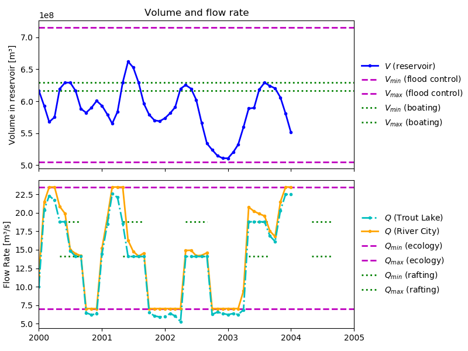

.. |---| unicode:: U+2014  .. em dash

Closed Loop Optimization
~~~~~~~~~~~~~~~~~~~~~~~~

.. note::

    This example shows a closed loop implementation of a previously described
    example: pareto optimality. If you are unfamiliar with this example, see
    :doc:`pareto_optimality`.

.. note::

    This example makes use of the `pandas` package, which is not installed
    together with RTC-Tools. You will have to install it yourself. This
    can be done with the pip package manager in a similar fashion as was
    done for RTC-Tools.

The purpose of this example is to show a closed-loop implementation of the BlueRiver example based
on Model Predictive Control (MPC). With this technique, forecast and measured data is used in an
optimisation routine to compute the optimal control-input ---similar to the open-loop 
implementation--- for a limited stretch of time into the future. Of these computed control-inputs,
only a part is implemented (often only the first element of the computed control-input sequence).
After waiting this same amount of time, the state of the system is measured ---measuring the 
response makes it closed-loop--- and this process of optimisation and application of part of the
control-sequence is repeated.

In MPC, the length of the time-span of the data which is used in the optimisation is called the 
prediction horizon or receding horizon. MPC settings used in this example can be modified in the
`MPC_settings.csv` file in the src folder. There, the lenght of the prediciton horizon and the
length of the time-span of implemented control are called `len_MPC_horizon` and
`len_MPC_timestep` respectively.

For convenience, a script, `copy_BlueRiver.py`, is added
which copies and renames the necessary files when they are not encountered in this example. This
behaviour can be turned of by modifying

.. literalinclude:: ../../../examples/closed_loop/src/closed_loop_example.py
  :language: python
  :lines: 17-18
  :lineno-match:

The Model
---------

To be able to implement closed-loop optimisation in the described manner, two categories of
changes to the open loop implementation are necessary:

1. Modifying the open-loop version: The open loop implementation must be made to handle varying
   initial conditions and endpoints in time.
2. Closing the loop: The final result in the timespan of `len_MPC_timestep` needs to be used as
   an initial condition in the next optimisation of the open-loop model ---with input-data from
   the new initial timepoint until the new prediction horizon--- and results of each of these 
   steps need to be saved to be able to form the final result.

Modifying The Open Loop Version
'''''''''''''''''''''''''''''''

In this example, a new class is made based on the open-loop version by inheriting from this class,
but since a new name needs to be given to this class, its name will differ from the name of the
class which was used in the modelica file. RTC-Tools assumes the name of the model class to equal
the name of the class which is used in the optimization, but this behaviour can be modified, as can
be seen in 

.. literalinclude:: ../../../examples/closed_loop/src/closed_loop_example.py
  :language: python
  :lines: 25-28
  :lineno-match:

Settings such as the MPC timestep and prediction horizon are set while initializing the class with

.. literalinclude:: ../../../examples/closed_loop/src/closed_loop_example.py
  :language: python
  :lines: 33-49
  :lineno-match:

These settings are used to modify the behaviour of the open loop system such that it will optimise
only on a limited part of the input data. The default `times` method is overloaded with the 
following custom method to change the first and final timepoints of the dataset that is used in
optimisation.

.. literalinclude:: ../../../examples/closed_loop/src/closed_loop_example.py
  :language: python
  :lines: 51-59
  :lineno-match:

In this example, indices of the timepoints are used explicitly because the measurement points are
not equidistant in time and we know the measurements are taken each month.
Finally, the history method of RTC-Tools is overloaded to use the state in the last stored 
results as initial state in the new optimisation problem.

.. literalinclude:: ../../../examples/closed_loop/src/closed_loop_example.py
  :language: python
  :lines: 61-71
  :lineno-match:

Closing The Loop
''''''''''''''''

The steps to close the loop are implemented in the ` run_closed_loop_implementation` function.
Based on the chosen MPC settings, the number of optimisations is computed in

.. literalinclude:: ../../../examples/closed_loop/src/closed_loop_example.py
  :language: python
  :lines: 77-80
  :lineno-match:

A loop is started in which the new `BlueRiver_closed_loop` class is used in optimisation
by RTC-Tools.

.. literalinclude:: ../../../examples/closed_loop/src/closed_loop_example.py
  :language: python
  :lines: 90-93
  :lineno-match:

The initial conditions of each optimisation together with the first `len_MPC_timestep` datapoints
of the results are stored into a history variable.

.. literalinclude:: ../../../examples/closed_loop/src/closed_loop_example.py
  :language: python
  :lines: 97-113
  :lineno-match:

Conversions in the representation of time and the variables-names are performed and the results
are appended to a pandas dataframe.

.. literalinclude:: ../../../examples/closed_loop/src/closed_loop_example.py
  :language: python
  :lines: 115-139
  :lineno-match:

Finally, after completing the accumulated results are stored in a csv file

.. literalinclude:: ../../../examples/closed_loop/src/closed_loop_example.py
  :language: python
  :lines: 143-144
  :lineno-match:

The Whole Script
''''''''''''''''

All together, the whole example script ---with exception of the `copy_from_pareto_optimality` and
`load_MPC_settings` helper scripts--- is as follows:

.. literalinclude:: ../../../examples/closed_loop/src/closed_loop_example.py
  :language: python
  :lineno-match:

Extracting Results
------------------

Results of this example are extracted in a similar fashion as was done in
:doc:`pareto_optimality`. The main difference between the two examples is that the number of
datapoints in the results are no longer constant and equal to the number of datapoints in the
input data, but depends on the MPC settings which are used. Using a longer prediction horizon than
the length of the MPC timestep will result in the input data not being fully used, as can be seen
in the following figure where a MPC timestep of one year is used with a prediction horizon of two
year, meaning that results of 2004-2005 should be based on an optimization with data from
2004-2006, but this optimisation can not be performed as no data from 2006 is available.

The full script of plotting these results with the python library matplotlib is shown below:

.. plot:: examples/pyplots/closed_loop_results.py
   :include-source:

Further description of results to be filled in by Bernhard.
