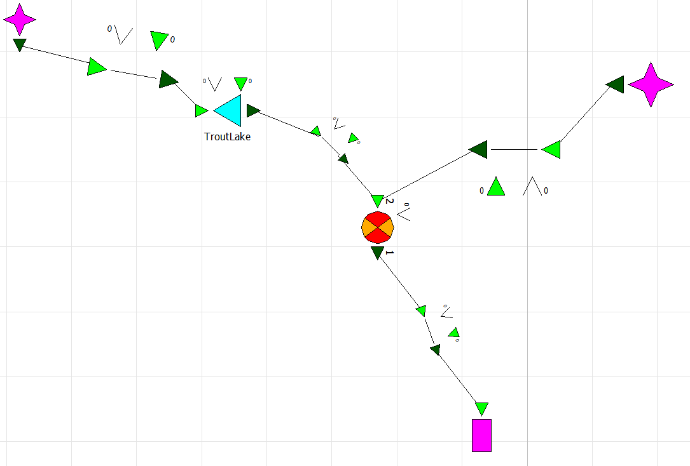
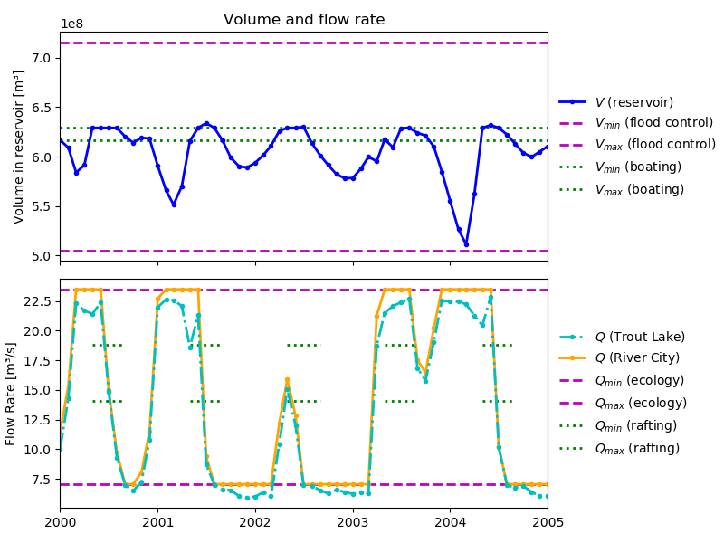

Goal Programming: Pareto Optimality
~~~~~~~~~~~~~~~~~~~~~~~~~~~~~~~~~~~

.. note::

    This example focusses on multi-objective optimization in
    RTC-Tools using goal programming. If you are unfamiliar with goal
    programming, see
    :doc:`goal_programming`.

The purpose of this example is to show the ease of exploring a set of pareto optimal solutions in 
RTC-Tools with goal-programming. With a pareto optimal solution is meant a solution which can not
be improved with relation to any of the individual goals, without compromising on any of the other
goals.

To illustrate this, we use the case of the Blue River water system. This example is
taken from O'Connell and Harou [OCHa11]_. The objective is to control the reservoir ``Trout Lake`` 
such that operating goals for the reservoir volume and the discharge at ``River City`` downstream
of the reservoir are maintained.

The goals are set with the following topics in mind:

* dam safety and minimum volume: The reservoir volume must remain within a certain range to ensure
  that no overtopping of the dam occurs and that the water level does not fall below a minimum value. 
* flood control: the discharge at "River City" downstream of the reservoir must not exceed the 
  flood warning level.
* recreational boating: the volume in the reservoir lake should be high enough to facilitate
  recreational boating.
* recreational rafting: the release at the lake should high enough at times to facilitate
  recreational rafting. This goal is only active in the summer months.
* ecology: the flow rate of water through River City has a minimal value for ecological reasons.

It will not be possible to fulfill all these goals under the given hydrological conditions, meaning
that a choice needs to be made between the solutions.

The Model
---------

The water system consists of a reservoir "Trout Lake" and a river section downstream of the
reservoir. A tributary enters the river at a location called Alder, and at the downstream end of
the river section a city is located ("River City").

In OpenModelica Connection Editor, the model looks like this:

In text mode, the Modelica model looks as follows (with annotation statements
removed):

.. literalinclude:: ../../_build/mo/BlueRiver.mo
  :language: modelica
  :lineno-match:

The Optimization Problem
------------------------

The python script consists of the following blocks:

* Import of packages
* Declaration of Goals
* Declaration of the optimization problem class

  * Constructor
  * Specification of Goals
  * Additional configuration of the solver

* A run statement

Importing Packages
''''''''''''''''''

For this example, the import block is as follows:

.. literalinclude:: ../../../examples/pareto_optimality/src/blue_river_example.py
  :language: python
  :lines: 1-7
  :lineno-match:

Declaring Goals
'''''''''''''''

In this example, the helper goal class, ``StateGoal`` is used to generate a StateRangeGoal class
which is used to set the four goals in the optimization problem. 

.. literalinclude:: ../../../examples/pareto_optimality/src/blue_river_example.py
  :language: python
  :lines: 10-26
  :lineno-match:

Optimization Problem
''''''''''''''''''''

The optimization problem is constructed by declaring it and inheriting the desired parent classes.

.. literalinclude:: ../../../examples/pareto_optimality/src/blue_river_example.py
  :language: python
  :lines: 29-30
  :lineno-match:

A constraint is added to limit the volume in the reservoir

.. literalinclude:: ../../../examples/pareto_optimality/src/blue_river_example.py
  :language: python
  :lines: 39-45
  :lineno-match:

In this example, all the goals apply for each timepoint, so they are added as path goals:

.. literalinclude:: ../../../examples/pareto_optimality/src/blue_river_example.py
  :language: python
  :lines: 47-67
  :lineno-match:

The arguments given in each of the four goals are processed in the ``__init__`` method of the 
StateRangeGoal class, meaning that e.g., in optimization of the goal with relation to flood
control, a solution is sought with the reservoir volume remaining between 
505066826.8963750 m\ :sup:`3` and 715419465.7775500 m\ :sup:`3`. The targets in this goal are
constant over the optimization problem, but this is not necessary. The goal with relation to
recreational rafting uses flow rate targets which are loaded from the timeseries_import file as
``Rafting_Qmin`` and ``Rafting_Qmax``.
Looking back into the ``StateRangeGoal`` class, it can be seen in the ``__init__`` method that the
fourth argument from self gives the priority of the ``StateRangeGoal``. Interchanging the fourth 
argument in the four path goals can therefore result in various optimal solutions with emphasis on
other goals.

The final solver configuration block is identical to the one used in :doc:`goal_programming`.

Run the Optimization Problem
''''''''''''''''''''''''''''

The optimization problem is started from the last line which starts the optimization script
for the constructed problem

.. literalinclude:: ../../../examples/pareto_optimality/src/blue_river_example.py
  :language: python
  :lines: 77-78
  :lineno-match:

The Whole Script
''''''''''''''''

Altogether, the whole example script is as follows:

.. literalinclude:: ../../../examples/pareto_optimality/src/blue_river_example.py
  :language: python
  :lineno-match:

Extracting Results
''''''''''''''''''

The results from the run are found in ``output/timeseries_export.csv``. Any
CSV-reading software can import it, but this is how results can be plotted using
the python library matplotlib:

.. plot:: examples/pyplots/pareto_optimality_results.py
   :include-source:

Among the goals in the code used in this example, the priorities in descending order are:
dam safety (1), ecology and flood control (3), rafting (4) and recreational boating (5). The two
highest priority goals are fulfilled at all times; the volume and flow rate remain in the target
range visible by the dashed magenta lines. With two volume flows upstream from River City, it is
however not always possible to fulfill the recreational goals; the volume and flow rate do not
remain between the dotted lines (when present). 

In this example a higher priority is given to rafting than to boating. A solution when the 
priorities for these two recreational goals are interchanged is shown below. 

Comparing the two figures, it is visible that in the former case, 
the volume flow rate at the lake remains within the target range for rafting, with only four
periods in which the volume allows for recreational boating. The later results show however that
with switched recreational priorities, five periods can be attained which allow for recreational
boating. This is to the detriment of the time at which rafting is possible.

.. rubric:: References

.. [OCHa11] O’Connell, S. & Harou, J.: HEC-ResPRM Prescriptive Reservoir Quick Start Guide, US Army
 Corps of Engineers, 2011